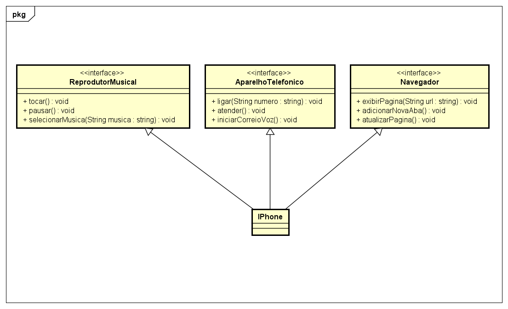

# DIO - Trilha POO Java

## Autor do Desafio e Repositório Original
- [Gleyson Sampaio](https://github.com/glysns)
- [Desafio Diagramação de Classes do Iphone](https://github.com/digitalinnovationone/trilha-java-basico/tree/main/desafios/poo)

## Desafio
Diagramar e modelar um Iphone em `UML` e `código` com base no vídeo de lançamento do [primeiro Iphone em 2007](https://www.youtube.com/watch?v=9ou608QQRq8). Sendo este um aparelho inovador com capacidade de reproduzir músicas, navegar na internet e realizar chamadas telefonicas.
Utilizando conceitos de POO, representar as seguintes funções:

- `Reprodutor Musical`: tocar, pausar, selecionarMusica
- `Aparelho Telefônico`: ligar, atender, iniciarCorreioVoz
- `Navegador`: exibirPagina, adicionarNovaAba, atualizarPagina

## Diagrama UML
Diagrama UML elaborado na plataforma [`Astah`](https://astah.net/pt/) que representa o Iphone herdando as características apresentadas:

        

